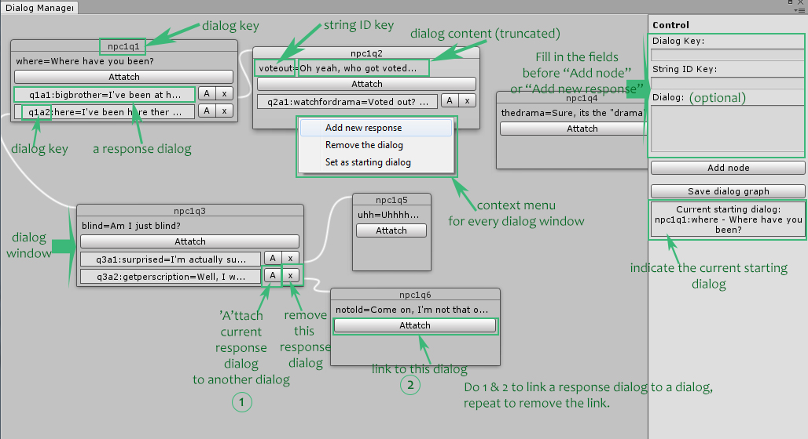

(In progress)

*To access the dialog editor: Unity Editor Menu -> Windows -> Dialog Manager
*To test the dialog, run the main scene and click on the button labeled "Test"

About the Dialog Editor
(A visual explanation in dialogmanagerwindow.jpg)
*To link a response dialog with another dialog, press the button labeled "A" beside the response dialog and then press the button labeled "Attach" inside the dialog window you want to link to
*Repeat the above to unlink the dialogs
*To add a dialog window, fill the required fields in the side window and then click on "Add new node" (invalid input will produce error log in the console window)
*To add a response dialog, fill the required fields in the side window and then right click on a dialog window and select "Add new response" in the context menu
*To remove a dialog window, right click on the dialog window and select "Remove dialog" in the context menu
*To remove a response dialog, click on the button labeled "x" beside the response dialog
*To set a dialog as the starting dialog for testing conversation, right click on the dialog window and select "Set as starting dialog" in the context menu
*To save the changes to the dialogs, click on "Save dialog graph" button in the side window to the right of Dialog Manager editor

Note: 
- Save the dialog graph after making any changes to the predefined dialogs and before running the scene for testing.
- The saved dialog graph is  in Assets/Resources/dialogGraph.dat.
- Editing the dialog content can only be done manually by changing the file  Assets/Resources/Text/EN.txt
- Only linking a response dialog to a dialog window works; the opposite would not work. Linking a response dialog with another response dialog will not work; neither does linking a dialog with another dialog.
- The Dialog ID key must be unique. The string ID key does not have to be unique. If an existing string ID key is entered when creating a new dialog, the existing string content will be used for this dialog.

*Dialog Editor features:
1. Add a dialog by creating a unique Dialog ID Key, a string ID key, and an optional dialog phrase.
2. Remove a dialog.
3. Link two dialogs (selectable response dialog to a single dialog)
4. Set a particular dialog as the starting dialog for a conversation
5. Save the dialogs and their links

Credits:
* The node graph style editor GUI is inspired by https://github.com/Baste-RainGames/Node_Editor and https://forum.unity3d.com/threads/simple-node-editor.189230/
* The Graph data structure representation for dialogs is from https://msdn.microsoft.com/en-us/library/aa289152(v=vs.71).aspx
* The testing scene is from tutorial https://unity3d.com/learn/tutorials/modules/intermediate/live-training-archive/modal-window

Other References:
http://gamedev.stackexchange.com/questions/103718/what-are-the-steps-to-instantiate-a-button-in-unity
https://forum.unity3d.com/threads/editorwindow-draggable-gui-window-and-dragging-to-pan-solved.291413/
https://docs.unity3d.com/ScriptReference/GenericMenu.html
https://unity3d.com/learn/tutorials/topics/scripting/persistence-saving-and-loading-data